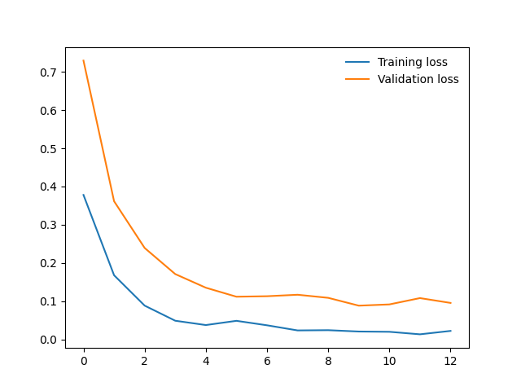

# Shufflenet
Repository contains first assignment for Deep Learning course 


## Assignment Description
Create neural network for image classification and localization for given
classes.
<br>
- Classification model - shufflenet.
- Classes - Headphones, Coffee, Raven
- Tasks to predict - class, <i> x<sub>c</sub>, y<sub>c</sub>, w, h.</i>

## Tasks 

- [x] Predict class
- [x] Create graphical user interface
- [ ] Predict <i> x<sub>c</sub>, y<sub>c</sub>, w, h </i> (localization part works partially, some mofifications needed as coordinates are not always correct)

## Structure
- `app.py` - main application file, which executes the following logic: 
    - Downloading images from http://openimages.com/
    - Training model for classes (<i>Headphones, Coffee, Raven</i>)
 - `dataloader.py` -  loads and divides data into train (80%) and test (20%) data 
 - `inference.py` - tests the model with gradio interface
 - `localization.py `- predicts object coordinates
 - `shufflenetmodel.pth ` - trained model

 ## Training results
 5 epochs were used for shufflenet model training. Tests showed that 5 epochs are enought to achieve high accuracy.

 New model later saved to `shufflenetmodel.pth`
 <br>
### Statistics


Training output:
 ```
 Epoch 1/5.. Train loss: 0.983.. Test loss: 0.729.. Test accuracy: 0.851
Epoch 1/5.. Train loss: 0.437.. Test loss: 0.362.. Test accuracy: 0.853
Epoch 2/5.. Train loss: 0.230.. Test loss: 0.239.. Test accuracy: 0.915
Epoch 2/5.. Train loss: 0.128.. Test loss: 0.171.. Test accuracy: 0.959
Epoch 2/5.. Train loss: 0.098.. Test loss: 0.135.. Test accuracy: 0.959
Epoch 3/5.. Train loss: 0.127.. Test loss: 0.112.. Test accuracy: 0.967
Epoch 3/5.. Train loss: 0.097.. Test loss: 0.113.. Test accuracy: 0.967
Epoch 4/5.. Train loss: 0.062.. Test loss: 0.117.. Test accuracy: 0.962
Epoch 4/5.. Train loss: 0.064.. Test loss: 0.109.. Test accuracy: 0.967
Epoch 4/5.. Train loss: 0.054.. Test loss: 0.089.. Test accuracy: 0.971
Epoch 5/5.. Train loss: 0.053.. Test loss: 0.092.. Test accuracy: 0.975
Epoch 5/5.. Train loss: 0.035.. Test loss: 0.108.. Test accuracy: 0.974
Epoch 5/5.. Train loss: 0.059.. Test loss: 0.096.. Test accuracy: 0.965
```

## Graphical User Interface
GUI accesible via https://15426.gradio.app
> NOTE: this share link expires in 72 hours.


